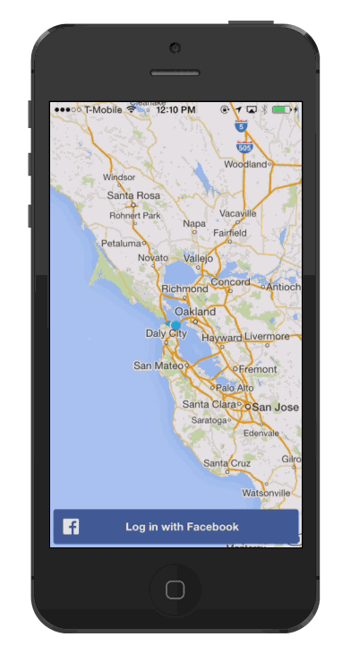

# Status: Archived
This repository has been archived and is no longer maintained.

# This is a legacy Firebase example (for SDK 2.x.x). You probably want to use one of the up-to-date examples at https://firebase.google.com/docs/samples

---

Firebase iOS Location Demo
=============
This is an example iOS app that will show you how to integrate the Firebase iOS SDK, Google Maps iOS SDK, and the Facebook iOS SDK.

#Setup
##Installing Frameworks
1. Firebase SDK (Latest)
  - Add the Firebase SDK to the project's Frameworks
1. [Facebook SDK](https://developers.facebook.com/resources/facebook-ios-sdk-current.pkg)
  - Add the Facebook SDK to the project's Frameworks
1. [GMS SDK](https://dl.google.com/geosdk/GoogleMaps-iOS-1.8.1.zip)
  - Add the GMS SDK to the project's Frameworks and select 'Copy into destination group's folder'
1. GoogleMaps bundle (found in the copied GoogleMaps.Framework. see [documentation](https://developers.google.com/maps/documentation/ios/start#getting_the_google_maps_sdk_for_ios))

##Installing Dependencies
1. GMS SDK
  1. AVFoundation.framework
  2. CoreData.framework
  3. CoreLocation.framework
  4. CoreText.framework
  5. GLKit.framework
  6. ImageIO.framework
  7. libc++.dylib
  8. libicucore.dylib
  9. libz.dylib
  10. OpenGLES.framework
  11. QuartzCore.framework
  12. SystemConfiguration.framework
2. Firebase SDK
  1. libicucore.framework
  2. CFNetwork.framework
  3. Security.framework
  4. Accounts.framework
  5. Social.framework

##Configuring the Build
1. Build Settings > (All, Combined) > Other Linker Flags = `-ObjC`

##Setup a new Facebook App
Follow Facebook's [Getting Started Guide](https://developers.facebook.com/docs/ios/getting-started) to setup a new facebook app and obtain a Facebook App Id and App Secret

1. Configure `location-demo-Info.plist` in Support Files to include `FacebookAppID`, `FacebookDisplayName`, and `URL types` per the values specified in the guide above
2. Add a valid contact email under Settings in the "Apps" tab
3. Make the app live to the general public under Stats & Review in the "Apps" tab

##Setup a new Google Maps App
Follow Google's [Getting Started Guide](https://developers.google.com/maps/documentation/ios/start#getting_the_google_maps_sdk_for_ios) to setup an app and obtain an API key

1. Obtain an API Key
2. Add an entry to `location-demo-Info.plist` with the key `GMSAPIKey` and your API key as the value
  - This is used to render the map in `AppDelegate.m` in <pre>`[GMSServices provideAPIKey:[plist objectForKey:@"GMSAPIKey"]]`</pre>

##Setup Firebase Login with Facebook
1. Enable Facebook Login in the Login tab on your Firebase Dashboard
  1. Add your Facebook App ID and Facebook App Secret
2. Add Firebase as a Valid OAuth Redirect URI by adding the URL: `https://auth.firebase.com/auth/facebook/callback` in the Facebook Advanced tab under Settings in Facebook

#Code
##Login using Facebook
- Use [FBLoginView](https://developers.facebook.com/docs/facebook-login/ios/v2.1)
  - Add Facebook Login to the View Controller (see `loadFacebookView` in `ViewController.m`)
  - Override the `application:openURL:sourceApplication:annotation:` function in `AppDelegate.m`

##Authenticate to Firebase
- Use the Facebook auth token
  - <pre>NSString *fbAccessToken = [[[FBSession activeSession] accessTokenData] accessToken];</pre>
- Create a `FirebaseLogin` object
- Call `loginWithFacebookWithAccessToken:withCompletetionBlock:` in `AppDelegate.m`

##Add Google Maps to the View Controller
- See `loadMapsView` in `ViewController.m`
